# AI Knowledge Assistant - Security Architecture Overview

## System Architecture Diagram

```mermaid
graph TD
    %% External Components
    A["🌐 Web Browser (⚠️ Untrusted Input)"] -->|HTTPS Requests| B["🔒 Flask Web Server"]
    C["🔑 OpenAI API (External)"] -->|API Calls| D["🤖 AI Analysis Service"]
    
    %% Core Application Components
    B --> E["📊 Request Handler 🔒"]
    E --> F["🔍 Input Validation 🔒"]
    F --> G["💾 SQLite Database"]
    F --> D
    
    %% Data Flow Components
    D --> H["📝 Content Analyzer"]
    H --> I["🏷️ Entity Extractor"]
    I --> G
    
    %% Template System
    B --> J["🎨 Template Engine"]
    J --> K["📄 HTML Templates"]
    K --> A
    
    %% Security Boundaries
    subgraph "🔒 Trusted Zone"
        E
        F
        G
        H
        I
        J
        K
    end
    
    subgraph "⚠️ Untrusted Zone"
        A
        C
    end
    
    %% Styling
    style A stroke:#f00,stroke-width:3px
    style C fill:#ff9,stroke:#900
    style G fill:#ff9,stroke:#900
    style F fill:#9f9,stroke:#090
    style E fill:#9f9,stroke:#090
    
    %% Tooltips
    click A "User input validation required"
    click C "External API - rate limiting needed"
    click G "Sensitive data storage"
    click F "Input sanitization critical"
    click E "Session management required"
```



## Security Assessment Table

| Component | Criticality | Potential Vulnerabilities | Mitigation Strategies |
|-----------|-------------|--------------------------|----------------------|
| **Web Browser (Client)** | High | XSS, CSRF, Clickjacking | Input sanitization, CSP headers, CSRF tokens |
| **Flask Web Server** | Critical | Session hijacking, DoS | HTTPS, rate limiting, secure headers |
| **Request Handler** | High | Path traversal, IDOR | Input validation, authorization checks |
| **Input Validation** | High | XSS (SQL injection ✅ **FIXED**) | Output encoding needed |
| **SQLite Database** | Medium | Data exposure (SQL injection ✅ **FIXED**) | Encryption at rest needed |
| **AI Analysis Service** | Medium | Prompt injection, API abuse | Input sanitization, rate limiting |
| **Template Engine** | High | Template injection, XSS | Template sandboxing, output encoding |
| **OpenAI API** | Medium | API key exposure, rate limits | Environment variables, error handling |

## Threat Model Summary

### 🔑 **Key Trust Boundaries**
1. **Client-Server Boundary**: Web browser (untrusted) ↔ Flask server (trusted)
2. **External API Boundary**: Application ↔ OpenAI API (external service)
3. **Database Boundary**: Application ↔ SQLite database (trusted storage)

### 🚨 **Critical Data Flows**
1. **User Input → Analysis**: Raw content from users processed by AI
2. **AI Response → Storage**: Generated insights stored in database
3. **Database → Display**: Sensitive insights rendered in templates

### ⚠️ **High-Risk Components**

#### **1. Input Validation (High)**
- **Risk**: XSS, path traversal (SQL injection ✅ **FIXED**)
- **Current State**: Basic Flask validation + SQL injection protection implemented
- **Recommendation**: Implement comprehensive input sanitization for XSS prevention

#### **2. Database Security (Medium)**
- **Risk**: Data exposure (SQL injection ✅ **FIXED**)
- **Current State**: SQLite with parameterized queries ✅
- **Recommendation**: Encrypt sensitive data at rest

#### **3. Session Management (High)**
- **Risk**: Session hijacking, CSRF
- **Current State**: Basic Flask sessions
- **Recommendation**: Implement secure session handling

#### **4. API Security (Medium)**
- **Risk**: API key exposure, rate limiting
- **Current State**: Environment variables for API keys
- **Recommendation**: Implement API rate limiting and monitoring

### 🛡️ **Recommended Security Improvements**

#### **Immediate Actions (High Priority)**
1. **Input Sanitization**: Implement comprehensive input validation for XSS prevention
2. **XSS Protection**: Implement Content Security Policy (CSP)
3. **CSRF Protection**: Add CSRF tokens to all forms
4. **Data Encryption**: Encrypt sensitive data at rest

#### **Medium Priority**
1. **Rate Limiting**: Implement request rate limiting
2. **Error Handling**: Sanitize error messages
3. **Logging**: Implement secure audit logging
4. **HTTPS**: Ensure HTTPS in production

#### **Long-term Improvements**
1. **Authentication**: Implement user authentication system
2. **Authorization**: Add role-based access control
3. **Data Encryption**: Encrypt sensitive data at rest
4. **Security Headers**: Implement comprehensive security headers

## 🔍 **Security Analysis Details**

### **Attack Surfaces Identified**

#### **1. Web Interface (High Risk)**
- **Entry Points**: All form inputs, URL parameters
- **Vulnerabilities**: XSS, CSRF, injection attacks
- **Mitigation**: Input validation, output encoding, CSRF tokens

#### **2. Database Layer (Medium Risk)**
- **Entry Points**: All database queries
- **Vulnerabilities**: Data exposure (SQL injection ✅ **FIXED**)
- **Mitigation**: Parameterized queries ✅ **IMPLEMENTED**, input validation ✅ **ADDED**

#### **3. AI Service Integration (Medium Risk)**
- **Entry Points**: OpenAI API calls
- **Vulnerabilities**: API key exposure, prompt injection
- **Mitigation**: Secure API key storage, input sanitization

#### **4. Template System (High Risk)**
- **Entry Points**: Template rendering
- **Vulnerabilities**: Template injection, XSS
- **Mitigation**: Template sandboxing, output encoding

### **Data Sensitivity Classification**

#### **🔴 High Sensitivity**
- **User Content**: Raw input from users
- **AI Insights**: Generated analysis results
- **Database**: All stored insights and metadata

#### **🟡 Medium Sensitivity**
- **Analytics Data**: Usage statistics and metrics
- **Configuration**: Application settings

#### **🟢 Low Sensitivity**
- **Static Assets**: CSS, JavaScript, images
- **Public Templates**: HTML structure

## 📋 **Security Checklist**

### **✅ Implemented**
- [x] Environment variables for API keys
- [x] Basic Flask security features
- [x] SQLite database with proper schema
- [x] Input validation in forms
- [x] Error handling with try-catch blocks

### **❌ Missing (High Priority)**
- [ ] Comprehensive input sanitization for XSS prevention
- [ ] XSS protection (CSP headers)
- [ ] CSRF protection (tokens)
- [ ] Rate limiting
- [ ] Secure session management
- [ ] HTTPS enforcement
- [ ] Security headers implementation

### **✅ Completed (Critical)**
- [x] SQL injection prevention (parameterized queries) ✅ **COMPLETED**

### **⚠️ Recommended**
- [ ] User authentication system
- [ ] Role-based access control
- [ ] Data encryption at rest
- [ ] Audit logging
- [ ] Security monitoring
- [ ] Regular security assessments

## 🔧 **Recent Security Fixes Implemented**

### **SQL Injection Prevention (COMPLETED)**
**Date**: January 2025  
**Criticality**: Critical  
**Status**: ✅ **COMPLETED**

#### **Vulnerability Fixed:**
- **Location**: `database.py` - `get_all_insights()` function
- **Issue**: Direct string interpolation in LIMIT clause: `f' LIMIT {limit}'`
- **Risk**: SQL injection allowing malicious query execution

#### **Implementation:**
```python
# BEFORE (Vulnerable)
query += f' LIMIT {limit}'

# AFTER (Secure)
query += ' LIMIT ?'
params.append(limit)
```

#### **Additional Security Measures Added:**
1. **Input Validation**: All numeric parameters validated and bounded
2. **Type Safety**: Integer conversion with error handling
3. **Bounds Checking**: Reasonable limits (0-1000) for query parameters
4. **Malicious Input Protection**: SQL injection attempts safely handled

#### **Testing Results:**
- ✅ **Normal Operations**: All functions working correctly
- ✅ **Malicious Inputs**: `'5; DROP TABLE insights; --'` → Safely handled
- ✅ **Type Attacks**: `'16 OR 1=1'` → Safely rejected
- ✅ **Boundary Tests**: Negative values → Defaulted to safe values

#### **Files Modified:**
- `database.py`: All database query functions updated
- **Functions Secured**: `get_all_insights()`, `get_popular_tags()`, `get_popular_entities()`, `get_insight_by_id()`, `update_insight_favorite()`, `add_tag_to_insight()`

---

## 🚀 **Deployment Security Considerations**

### **Production Environment**
1. **HTTPS Only**: Enforce HTTPS in production
2. **Security Headers**: Implement comprehensive security headers
3. **Environment Variables**: Secure API key management
4. **Database Security**: Consider encrypted database
5. **Monitoring**: Implement security monitoring and alerting

### **Development Environment**
1. **Local Development**: Use secure development practices
2. **Code Review**: Implement security-focused code reviews
3. **Testing**: Add security testing to CI/CD pipeline
4. **Documentation**: Maintain security documentation

---

*This security architecture document should be reviewed and updated regularly as the application evolves.* 